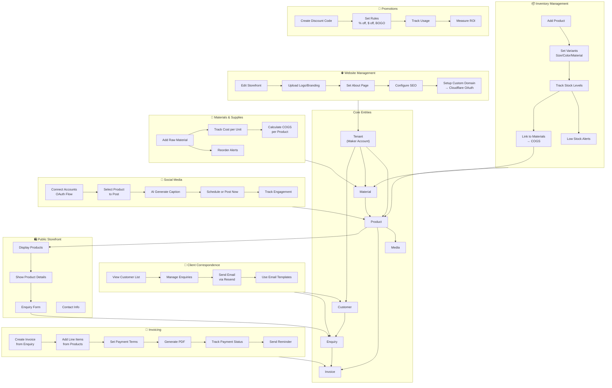

# MadeBuy Feature Modules & Data Relationships

```mermaid
flowchart TB
    subgraph Core["Core Entities"]
        Tenant["Tenant<br/>(Maker Account)"]
        Product["Product"]
        Material["Material"]
        Customer["Customer"]
        Enquiry["Enquiry"]
        Invoice["Invoice"]
        Media["Media"]
    end

    subgraph InventoryModule["📦 Inventory Management"]
        AddProduct["Add Product"]
        SetVariants["Set Variants<br/>Size/Color/Material"]
        TrackStock["Track Stock Levels"]
        AlertLow["Low Stock Alerts"]
        LinkMaterials["Link to Materials<br/>→ COGS"]
    end

    subgraph MaterialsModule["🧵 Materials & Supplies"]
        AddMaterial["Add Raw Material"]
        TrackCost["Track Cost per Unit"]
        CalcCOGS["Calculate COGS<br/>per Product"]
        ReorderAlert["Reorder Alerts"]
    end

    subgraph SocialModule["📱 Social Media"]
        ConnectAccounts["Connect Accounts<br/>OAuth Flow"]
        SelectProduct["Select Product<br/>to Post"]
        GenerateCaption["AI Generate Caption"]
        SchedulePost["Schedule or Post Now"]
        TrackEngagement["Track Engagement"]
    end

    subgraph MarketingModule["📢 Promotions"]
        CreateCode["Create Discount Code"]
        SetRules["Set Rules<br/>% off, $ off, BOGO"]
        TrackUsage["Track Usage"]
        MeasureROI["Measure ROI"]
    end

    subgraph CRMModule["💬 Client Correspondence"]
        ViewCustomers["View Customer List"]
        ManageEnquiries["Manage Enquiries"]
        SendEmail["Send Email<br/>via Resend"]
        UseTemplates["Use Email Templates"]
    end

    subgraph InvoicingModule["📄 Invoicing"]
        CreateInvoice["Create Invoice<br/>from Enquiry"]
        AddLineItems["Add Line Items<br/>from Products"]
        SetPaymentTerms["Set Payment Terms"]
        GeneratePDF["Generate PDF"]
        TrackPayment["Track Payment Status"]
        SendReminder["Send Reminder"]
    end

    subgraph WebsiteModule["🌐 Website Management"]
        EditStorefront["Edit Storefront"]
        UploadLogo["Upload Logo/Branding"]
        SetAbout["Set About Page"]
        ConfigureSEO["Configure SEO"]
        SetupDomain["Setup Custom Domain<br/>→ Cloudflare OAuth"]
    end

    subgraph StorefrontPublic["🛍️ Public Storefront"]
        DisplayProducts["Display Products"]
        ShowDetails["Show Product Details"]
        EnquiryForm["Enquiry Form"]
        ContactInfo["Contact Info"]
    end

    %% Core Relationships
    Tenant --> Product
    Tenant --> Material
    Tenant --> Customer
    Product --> Media
    Material --> Product
    Customer --> Enquiry
    Enquiry --> Invoice
    Product --> Invoice

    %% Module to Core
    InventoryModule --> Product
    MaterialsModule --> Material
    LinkMaterials --> Material
    CRMModule --> Customer
    CRMModule --> Enquiry
    InvoicingModule --> Invoice
    SocialModule --> Product
    WebsiteModule --> Tenant

    %% Internal Module Flows
    AddProduct --> SetVariants --> TrackStock --> AlertLow
    TrackStock --> LinkMaterials
    AddMaterial --> TrackCost --> CalcCOGS
    AddMaterial --> ReorderAlert
    ConnectAccounts --> SelectProduct --> GenerateCaption --> SchedulePost --> TrackEngagement
    CreateCode --> SetRules --> TrackUsage --> MeasureROI
    ViewCustomers --> ManageEnquiries --> SendEmail
    SendEmail --> UseTemplates
    CreateInvoice --> AddLineItems --> SetPaymentTerms --> GeneratePDF
    GeneratePDF --> TrackPayment --> SendReminder
    EditStorefront --> UploadLogo --> SetAbout --> ConfigureSEO --> SetupDomain

    %% Storefront Display
    Product --> DisplayProducts
    DisplayProducts --> ShowDetails --> EnquiryForm --> Enquiry
```
