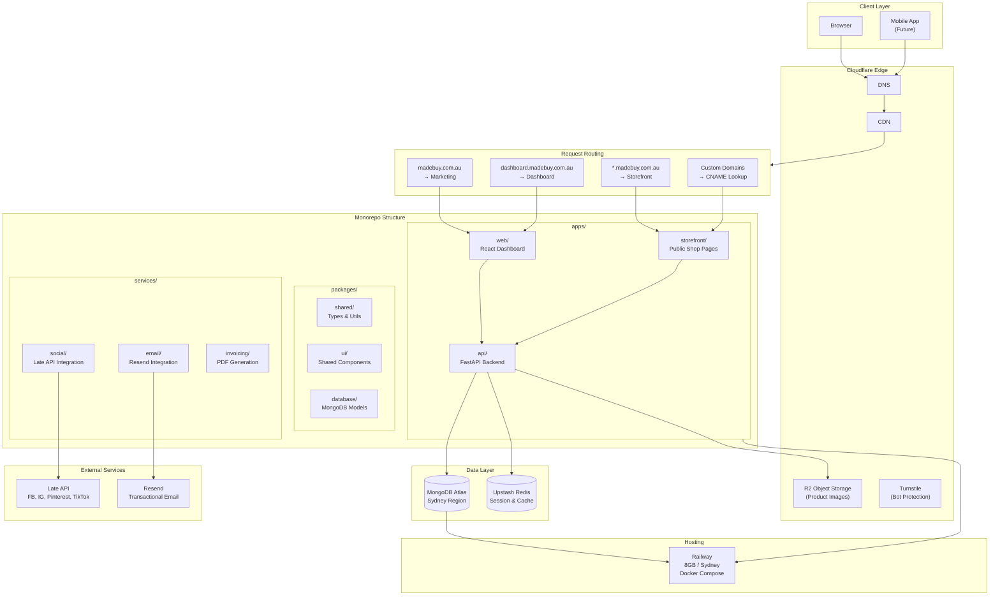

# MadeBuy Technical Architecture & Data Flow

```mermaid
flowchart TB
    subgraph Client["Client Layer"]
        Browser["Browser"]
        Mobile["Mobile App<br/>(Future)"]
    end

    subgraph Cloudflare["Cloudflare Edge"]
        DNS["DNS"]
        CDN["CDN"]
        R2["R2 Object Storage<br/>(Product Images)"]
        Turnstile["Turnstile<br/>(Bot Protection)"]
    end

    subgraph Routing["Request Routing"]
        MainDomain["madebuy.com.au<br/>→ Marketing"]
        SubDomain["*.madebuy.com.au<br/>→ Storefront"]
        DashDomain["dashboard.madebuy.com.au<br/>→ Dashboard"]
        CustomDom["Custom Domains<br/>→ CNAME Lookup"]
    end

    subgraph Monorepo["Monorepo Structure"]
        subgraph Apps["apps/"]
            WebApp["web/<br/>React Dashboard"]
            APIApp["api/<br/>FastAPI Backend"]
            StorefrontApp["storefront/<br/>Public Shop Pages"]
        end
        
        subgraph Packages["packages/"]
            Shared["shared/<br/>Types & Utils"]
            UI["ui/<br/>Shared Components"]
            DB["database/<br/>MongoDB Models"]
        end
        
        subgraph Services["services/"]
            SocialSvc["social/<br/>Late API Integration"]
            EmailSvc["email/<br/>Resend Integration"]
            InvoiceSvc["invoicing/<br/>PDF Generation"]
        end
    end

    subgraph DataLayer["Data Layer"]
        MongoDB[(MongoDB Atlas<br/>Sydney Region)]
        Redis[(Upstash Redis<br/>Session & Cache)]
    end

    subgraph External["External Services"]
        LateAPI["Late API<br/>FB, IG, Pinterest, TikTok"]
        Resend["Resend<br/>Transactional Email"]
    end

    subgraph Host["Hosting"]
        Railway["Railway<br/>8GB / Sydney<br/>Docker Compose"]
    end

    %% Connections
    Browser --> DNS
    Mobile --> DNS
    DNS --> CDN
    CDN --> Routing
    
    MainDomain --> WebApp
    SubDomain --> StorefrontApp
    DashDomain --> WebApp
    CustomDom --> StorefrontApp
    
    WebApp --> APIApp
    StorefrontApp --> APIApp
    
    APIApp --> MongoDB
    APIApp --> Redis
    APIApp --> R2
    
    SocialSvc --> LateAPI
    EmailSvc --> Resend
    
    Apps --> Railway
    MongoDB --> Railway
```
